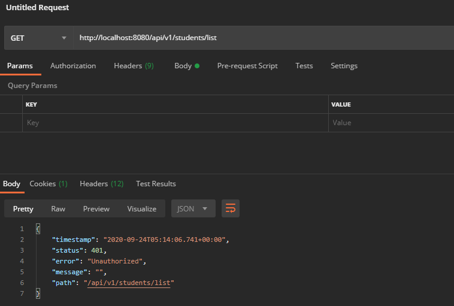
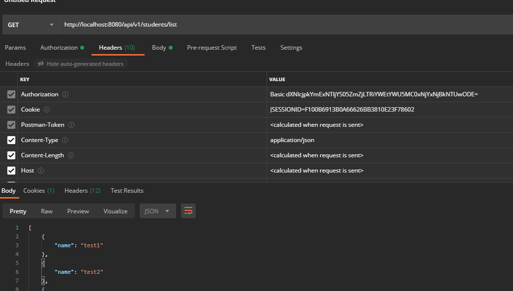

# security
스프링 시큐리티

# 스프링 시큐리티
* 라이브러리를 처음 임포트하면 모든 사용자 요청에 인증 요구


<br>

* 계정과 비밀번호는 base64인코딩을 하여 헤더에 포함시켜 서버에 전달


# 인증없이 특정 페이지 접근 허용
* authorizeRequests().anyMatchers().permitAll()
```java
@Override
protected void configure(HttpSecurity http) throws Exception {
        http
                .authorizeRequests()
                    .antMatchers("/", "/index", "/css/*", "/js/*").permitAll()

    ...
}
```

# Role and Permission
* Enum으로 Role과 Permission을 생성
* Role에 Permission을 적용

# Role 적용
```java
* hasRole 메소드 사용
@Override
    protected void configure(HttpSecurity http) throws Exception {
        http
                .authorizeRequests()
                    .antMatchers("/", "/index", "/css/*", "/js/*").permitAll()
                    .antMatchers("/api/**").hasRole(STUDENT.name())
    ...
}
```

# 참고자료
* [1] data.sql, schema.sql: https://www.baeldung.com/spring-boot-data-sql-and-schema-sql
* [2] 강의영상: https://www.youtube.com/watch?v=her_7pa0vrg